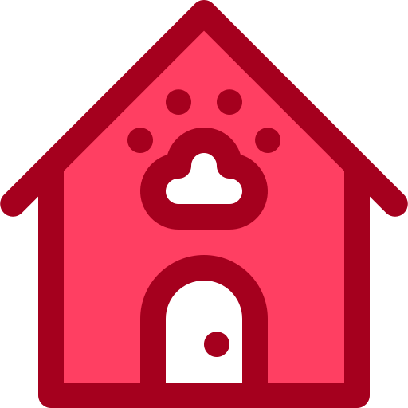

<!-- PROJECT LOGO -->
 

  

  <h3 align="center">Телеграм бот приюта для животных</h3>

  

    Командная работа для автоматизации работы приюта через телграм бота
     
    <a href="https://skyengpublic.notion.site/47bcac1b049f4af6b351e2ab5d05afb4"><strong>ТЗ проекта »</strong></a>
     
     
    <a href="">View Demo</a>
  

<!-- ABOUT THE PROJECT -->
## О проекте
Данный проект был создан разработчиками:
* Анна Роскач
* Тарасенко Мария
* Васильев Илья

Данный бот может обрабатывать обращения пользователей. Отвечать на популярные вопросы людей о том, что нужно знать и уметь, чтобы забрать животное из приюта, получать ежедневный отчет от новых хозяев о том, как животное приспосабливается к новой обстановке.

### Built With

В данном блоке представленны технологии разработки использованные в проекте.

* 
* 
* 
* 

<!-- ROADMAP -->
## Roadmap

- [x] Познакомится со своей командой
- [x] Cоздать пустой проект
- [ ] Начать разработку

<!-- CONTACT -->
## Contact

* Васильев Илья(Лидер) - [@V_IllI_e](https://t.me/V_IllI_e) - pilaroiding@gmail.com
* Роскач Анна - link...
* Тарасенко Мария - link...

Project Link: [PetLand](https://github.com/V4si1iy/PetLand)

(<a href="#readme-top">back to top</a>)

